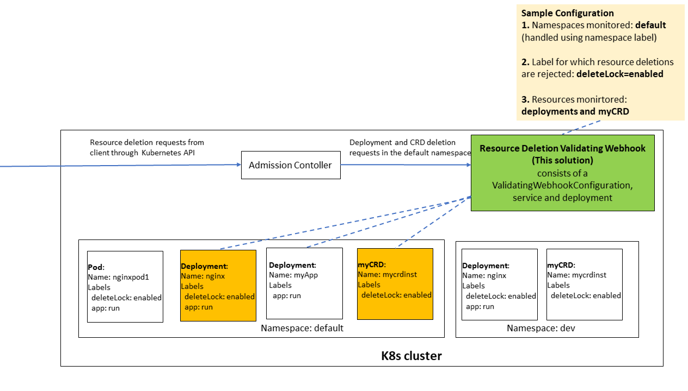

# Kubernetes resource deletion validation webhook
AdmissionControl validating webhook to block deletion of resources based on resource labels.

## What this solution does
For Configured Kubernetes namespaces and resources (deployments, crds etc) deletion requests are first processed by this webhook, and based on labels associated with the resource the resource deletion requests (kubectl delete resource .) are either rejected or allowed. The label keys and values for which resource deletion requests are rejected can also be configured.

## Solution Overview

* In the above diagram the validating webhook has been configured to monitor **deployments** and **myCRDs** in the **default** namespace
* So if deletion request for all 6 resources shown in the diagram above are made to the kubernetes API, the requests for the 2 deployments and myCRD resource in the default namespace will be forwarded to our webhook. 
* Since the webhook has been configured to reject resource deletion requests where resources have a label **deleteLock=enabled** the deletion requests for the deployment and myCRD highlighted in orange will be rejected.
* For the kubernetes core components to communicate with the webhook, TLS certificate and TLS key need to be created and associated with the webhook

## Reference solution
* The [avast/k8s-admission-webhook](https://github.com/avast/k8s-admission-webhook) is a good reference for create and update resource validations. 
* The avast solution has been referenced for the initialization / configuration of this application (using cobra, viper etc).

## Key Functions of webhook implementation
* webhook.go->validate : This operation receives the AdmissionReview request object from Kubernetes. It then extracts the name of the resource to be deleted, the namespace, the API group, the API version, and the resource type. These are then passed to the getResourceLabels Operations. The labels are then passed to the validate.go->isDeletionRequestToBeBlocked operation to check if the deletion is to be blocked
* webhook.go->getResourceLabels : This operation uses the REST client to fetch the labels for resource and returns the map or labels
* validate.go->isDeletionRequestToBeBlocked : This checks if the resource labels indicate that the resource is to be deleted or not.

## Installation
* The deployments/webhook-k8s-resources.template.yaml is the kubernetes manifest template for this solution. The main kubernetes resources to be created are ValidatingWebhookConfiguration, a deployment and a service. The template has place holders for the TLS Certificate, the TLS Key, the CA Bundle and the container image.
* The [Steps](https://github.com/avast/k8s-admission-webhook#example-configuration) mentioned explain how to replace values in the yaml template file. Instead of manually doing it you can using the makefile target gen-k8s-manifests from this solution 
* The makefile target gen-k8s-manifests in this solution has all steps to replace values in the template, and as an output it generates the deployments/webhook-k8s-resources.yaml which has certificate, key and the ca bundle in the yaml. To execute this make target you need to have access to the target kubernets cluster (KUBECONFIG or ./kube/config). Before running the make target, verify that the values of the CONTAINER_NAME, CONTAINER_VERSION, WEBHOOK_NAMESPACE and WEBHOOK_SERVICE_NAME in the Makefile are correct.  After this applying the deployments/webhook-k8s-resources.yaml creates all required kubernetes resources
* The Make target docker-build or docker-build-local can be used to create the container image. The docker-push make target can be used to push the container image to the container registry.

## Configuring the namespaces, resources and labels
